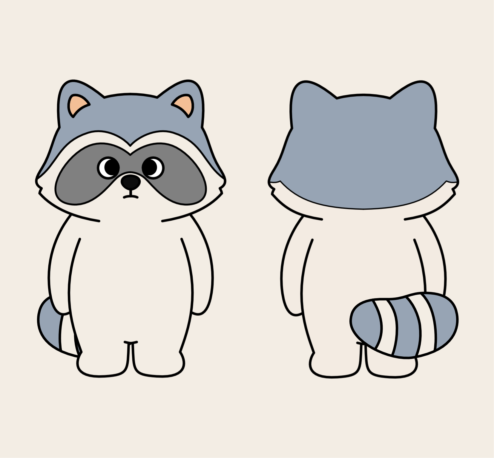
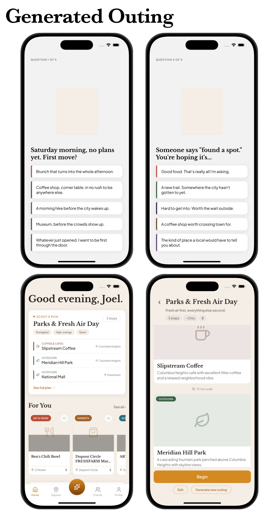
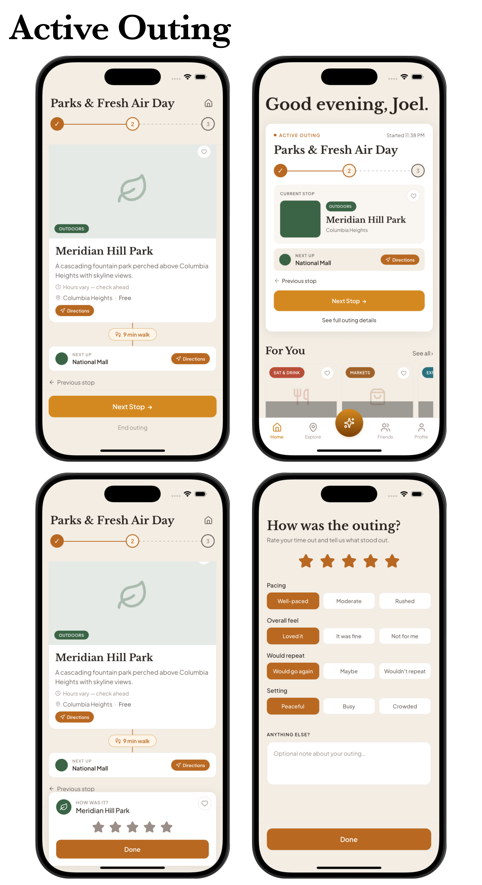
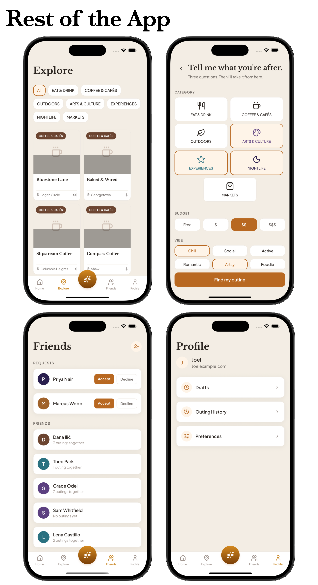

# Forage (placeholder name)

**Forage is a personalized outing planner that turns a short taste quiz into a full, multi-stop plan.**

You answer a few questions once, and Scout, a raccoon guide, builds the outing: where to go, what order, and how to get between stops. No searching, no filtering, no deciding.

> **Where this is right now:** working prototype, solo outings only, DC only. Onboarding, plan generation, and the full active-outing flow all work. Nothing saves once you close the app, there's no login, and stops are ordered by category, not real map distance yet.

> "Forage" is just a placeholder name I used while building this, not a final one. The design is also a snapshot, not final. It's going to keep changing as I add more features.

## Demo and screenshots









Explore and Profile are fully working. Friends and the outing-builder flow are early, shown here to give a sense of where they're headed.

Watch the full walkthrough: (https://drive.google.com/file/d/1TeQcEl3aEuaUOwUnIz-CkC2ecdJHO0GW/view?usp=sharing)

## Why I built this

I started spending a lot of time alone at parks, restaurants, markets, and events because I needed it for my mental health.

The more I did it, the more I noticed I kept ending up at the same handful of places. I didn't really know what new spots would fit what I liked, and I didn't want to burn my limited time somewhere I might not enjoy. Searching around long enough to find something new often talked me out of going out at all.

I couldn't find anything that would build a plan for me on the spot, so I built one myself. Washington, DC became the target because it's the closest city to me with a lot of different things packed close together, and because it gets enough visitors that this could also help someone new to a city. I live in a small city in Maryland, with not enough locations to build off of. DC was the right place to test the idea, but it's not the only city it will work in.

## How it works

1. You answer a taste quiz during onboarding
2. Your answers turn into a set of preference weights
3. Every venue gets scored against those weights
4. Anything closed or a bad fit for the current time gets filtered out
5. The number of stops changes depending on time of day and what's actually open
6. Stops get ordered so the day makes sense, cafes early, nightlife last
7. You start the outing, move through each stop, get directions, rate stops as you go, and see it saved to your history when you're done

The scoring and filtering here is all rule based, not an AI model picking places at runtime. Claude and Claude Code were the tools I used to build the app, they aren't running live inside it to generate your plan.

## How this was built

### What I owned vs. what the tools did

I designed and scoped every part of this myself, Scout's character and voice, the visual design, the suggestion engine's rules, and every call on what to build, cut, or put off. Claude Code wrote the actual code, and Claude, in a separate conversation, helped me think through decisions and review what got built, including pushing back on ideas I brought to it even when I already liked them.

### Getting specific with design prompts

My process changed a lot over time, mostly because I got things wrong at first. At the start, I'd send Claude Code short design instructions and assumed it would understand what I meant by a label size, card placement, or a button color. It usually didn't, and the result would either be technically fine but visually off, or it would drift from something I'd already asked for earlier. Eventually, I stopped sending those requests directly. I'd explain the decision to Claude first, what I wanted changed and why, with a reference picture if I had one, and let Claude turn that into a specific prompt for Claude Code to run. That extra step is what fixed most of the accuracy problems.

### The bug that changed how I verify things

I was fixing a bug where the Home screen kept showing a finished outing's card because the plan state never got cleared, and afterward the type checker came back completely clean. But the fix had exposed an older, separate bug in a different screen, where a piece of code was running after an early return, so it wasn't running consistently every time. That's a real problem in React, but it isn't something a type checker can ever catch, since it's a runtime rule, not a type rule. It had been sitting there broken for a while without ever crashing, because the only path that used to hit it also immediately redirected to a different screen before anything visibly broke.

I only found it because I tapped through the real flow myself in the simulator, finishing an outing and submitting the rating, and hit a hard error. Not the type checker, and not Claude Code telling me it looked fine. That was the point where I stopped trusting "the type checker is clean" as proof that anything worked. Now nothing gets committed without checking git status, reading the actual diff, running the type checker, and testing it by hand in the simulator, in that order, with the real output pasted back rather than just described. Something similar happened with a browser-based visual check that reported a set of onboarding screens as identical when the simulator showed obvious differences between them, which is why the simulator is now the only thing I trust for how something looks.

### Showing the process to other people

I also walked a few friends through the process itself, showing how a decision turned into a prompt with Claude and then a build from Claude Code and then a check that it actually worked. A couple of them started using Claude for their own work afterward.

## Decisions I made, and things I chose not to build

I cut three features, each for a different reason.

- **Outfits for Scout.** The idea was that visiting a new kind of place would unlock something you could put on Scout so the app felt more personal the more you used it. For example, going on a hiking trail unlocks a hiking backpack. I cut it because it started pushing the app toward feeling like a game with a collection system, and that's not what Forage is supposed to be.
- **Group planning.** Letting users say how many people are coming and building a plan around that. I cut this because a plan that actually works for a group needs to reconcile different people's tastes, which is a much harder problem than just adjusting a headcount, and I didn't want to ship a version that only looked personalized.
- **Build around an event.** If you have a concert or a market coming up, the app would build a plan around it, things to do before and after. I still think this is a good idea and want to build it eventually. I cut it for now purely because of time.

## What's built

**Onboarding**
- A taste quiz that feeds a scoring system
- Your first Scout-made plan, ready right after you finish it

**Plan generation**
- A suggestion engine that builds outings from 26 real DC venues across 7 categories
- Filtering based on real business hours
- Stop counts that change based on time of day, and shrink honestly late at night, if only one place is actually open, the app shows one stop instead of padding the plan with something that's closed
- Ordering so a plan makes sense across a day (coffee and cafes early, nightlife last, never the other way around)

**Active outing**
- Start it, move stop to stop, get directions, rate each stop, end early or finish
- See it saved to your history once it's done

**Drafts**
- A draft system with a limit, save and resume, and handling for conflicts

**Navigation**
- Home, Explore, Friends, and Profile tabs, all with real working functionality, not just placeholders
- Two "coming soon" features (Duo Planning and Build Around Saved Places) that are labeled honestly as not built yet

For the full, honest list of what's built, what's stubbed, and what I cut on purpose, see [DECISIONS.md](./DECISIONS.md).

## Tech stack

- React Native with Expo Router (SDK 54), TypeScript
- File based routing, no backend. Everything is stored in memory for this prototype, so nothing saves once you close the app
- Design system: Plus Jakarta Sans and Libre Baskerville, a warm cream and amber color palette, category colored icons across 7 venue categories

## What's next

Before I add anything new, I want to make sure everything already built works well, since the core features are what make the app good, and stacking new features on top of something unfinished could make it worse. The next step is going back through what's already here, fixing anything inconsistent, catching errors, and making sure it all holds up, before I move on to saving data, real map-based ordering, or building out Duo Planning and Build Around Saved Places.

## Known limitations

This is a prototype, not a finished product. The full honest list, including tradeoffs I made on purpose and gaps I know about but didn't have time to fix, is in [DECISIONS.md](./DECISIONS.md). A few of the bigger ones:

- Nothing saves. Close the app and most of it resets. This was a decision I made for a prototype on a deadline, not something I missed.
- The venue list has 26 places I hand picked for this prototype, and a few categories are thinner than others. The real goal is hundreds of venues per city, not a fixed number. 26 was what I could actually research and check by hand for a working demo.
- Stops are ordered by category only, not real location, since the venue data doesn't have coordinates yet.
- Friends and Duo Planning are demo quality: real screens, no backend, nothing saved.

## Running it

Screenshots and a full walkthrough recording are near the top of this README if you just want to see the app.

If you want to run it yourself, you'll need a Mac with Xcode installed (for the iOS Simulator) and Node.js.

```
npm install
npx expo start
```

Then press `i` to launch the iOS Simulator, which will install Expo Go into it automatically. No environment variables, API keys, or extra setup needed.
